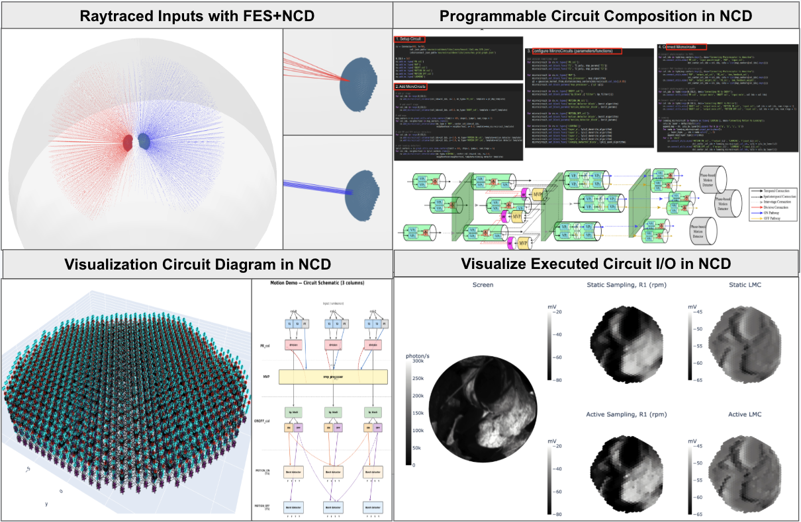
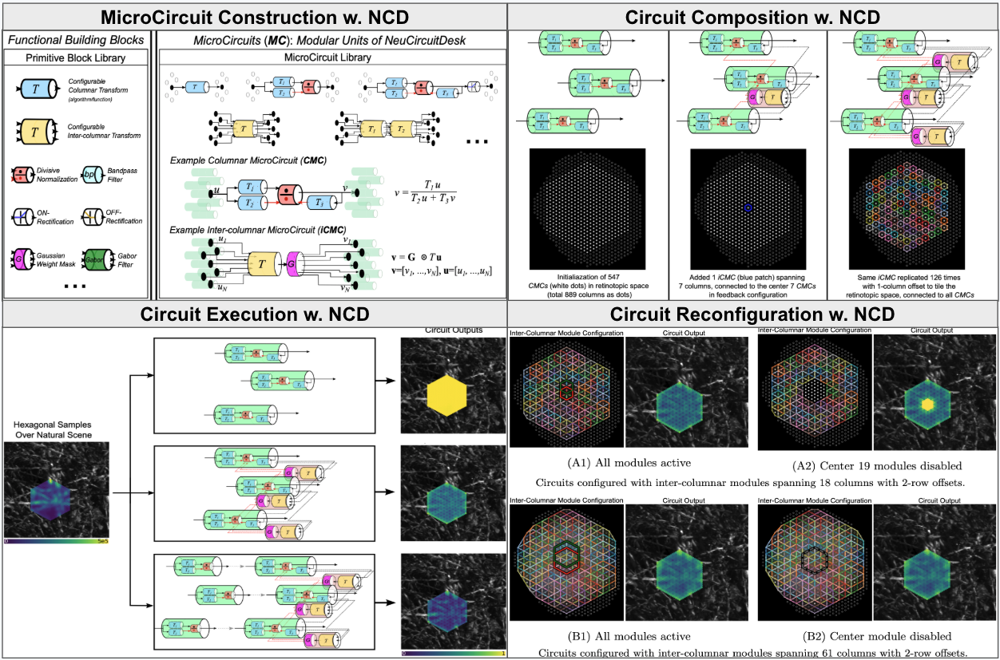

# NeuroCircuitDesk

Programmable ontology for composing, executing, and visualising executable neural circuits from connectomic graph abstractions of the *Drosophila* brain.

<p align="center">
  
</p>

## Overview

NeuroCircuitDesk (NCD) is a platform for translating static connectomic and morphological datasets into executable, geometry-aware circuit models. It is organized around four design principles:

- **Modularity** -- The core building blocks are self-contained *MicroCircuits* (MCs) constructed from a library of computational primitives (polynomial transforms, divisive normalization, temporal filters, rectifiers). Each MC has well-specified I/O ports and an encapsulated internal topology, allowing it to be reused or substituted without affecting other parts of the circuit.

- **Composability** -- MicroCircuits are integrated into larger architectures by wiring their public ports without exposing internal configurations. A high-level API automates parallel, cascaded, and recurrent connection patterns. NCD maps modules onto a hexagonal-columnar array that mirrors the biological compound eye, enforcing neighbourhood topology and preserving the geometry-constrained MIMO connections found in the biological system.

- **Reconfigurability** -- Users can dynamically toggle between feedforward and feedback motifs, swap templates, or selectively disable processing stages without rebuilding the system, enabling rapid ablation studies and architectural experimentation in retinotopic space.

- **Scalability** -- Circuit specifications apply uniformly from small neighbourhoods to the full retinotopic map (800+ columns), preserving both spatial placement and geometrically constrained inter-columnar connectivity.

<p align="center">
  
</p>

**MicroCircuit Construction** -- MicroCircuits come in two canonical categories: *Columnar MicroCircuits* (CMCs) operating within a single retinotopic column (e.g., photoreceptors, LMCs), and *Inter-columnar MicroCircuits* (iCMCs) processing information across multiple parallel columns (e.g., amacrine cells). Both are assembled from the same primitive block library and can be customized programmatically.

**Circuit Composition** -- Column-local cascades connect CMCs sequentially within each column; cross-column computation routes CMC outputs into iCMCs for spatially defined processing; inter-stage connections link outputs between stages for cascading or MIMO feedback configurations.

**Circuit Execution** -- Composed circuits are compiled into an executable Program (scalar NumPy engine) or VectorizedProgram (batched MLX engine for Apple Silicon), with time-series inputs producing time-series outputs that can be visually inspected and exported.

**Circuit Reconfiguration** -- Individual MicroCircuits or entire processing stages can be substituted, reparameterized, toggled, or removed to observe their effect on the overall circuit output.

## Packages

- **`neurocircuitdesk/`** -- Modular circuit design and execution framework. Define MicroCircuit templates, compose them on a retinotopic Canvas, compile to a scalar `Program` or vectorised `VectorizedProgram` (MLX backend), and render either interactive 3D circuit diagrams or publication-style 2D schematics. Ships a `VideoInput` universal loader (h5 / mp4 / image-frames → standardised `(T, H, W)` HDF5), a `stimuli` module (looming dot, saccade scan, drifting grating, flicker, fixational drift), a `libs.microcircuit_templates` catalog of five shipped CMC / iCMC templates, and a `libs.algorithms` module with drop-in motion detectors (Borst, HR, Barlow-Levick).
- **`flyeyesimulator/`** -- Compound-eye optical simulator. Builds hexagonal retina geometry with neural superposition, projects video onto a spherical screen, and runs static or physics-driven (active) receptive-field simulations. Supports CuPy (CUDA), MLX (Apple Silicon), and NumPy backends. Ships a `phototransduction` module (RPM cascade + non-spiking Hodgkin–Huxley membrane, backend-matched at import) that converts the `(T, 6·N_cols)` photon-rate output into per-photoreceptor voltage, and an `IOViz` class that renders the screen + multiple retina-panel meshes as a single synchronised Plotly figure (1-row or 2-row layout with the screen on the left).

### FlyEyeSimulator and NCD

FlyEyeSimulator (FES) serves as the optical front-end for NCD. In the full pipeline, FES constructs a biologically accurate `Retina` and projects video onto a spherical `Screen`, then runs either a static or physics-driven active simulator to produce per-photoreceptor photon-rate time series. For voltage-domain handoff into NCD circuits, the `phototransduction` module runs the RPM + HH(NS) model with `pr(res)` and aggregates the six R-cells in neural-superposition via `aggregate_pr(V_TN6, num_cols)` to produce the `(T, N_cols)` per-column voltage trace that NCD photoreceptor microcircuits expect at their `input_main` port. FES also provides `RetinaViz`, `ScreenViz`, `SimulatorViz`, and `IOViz` for visualising the inputs, outputs, and the combined pipeline.

When FES is not available (or when a lighter-weight workflow is preferred), NCD includes a built-in fallback via `io_utils`: `HexActiveSampleSpring` and `HexActiveSampleKinetic` sample video frames directly through a hex grid of receptive fields without spherical projection or ray-tracing, producing the same `(T, N)` arrays. `HexViz` provides retinotopic plotting (including inline-embedded MP4 row layouts via `show_video_inline` / `show_videos_row_inline`) compatible with the RetinaViz layout. This allows NCD circuits to be developed and tested with video input independently of FES.

## Install

```bash
pip install -e ./neurocircuitdesk
pip install -e ./flyeyesimulator
```

Optional extras:

```bash
pip install -e './neurocircuitdesk[mlx]'          # Apple Silicon GPU backend (NCD circuits)
pip install -e './flyeyesimulator[mlx]'           # Apple Silicon GPU backend (FES optical pipeline)
pip install -e './flyeyesimulator[cupy-cuda12]'   # CUDA GPU backend (FES optical pipeline)
```

## Demos

Self-contained demos live under `docs/demos/`. Scripts can be run directly:

```bash
# Fly-eye geometry: retina construction, neural superposition, binocular setup
python docs/demos/demo_flyeye.py                  # all demos
python docs/demos/demo_flyeye.py single            # single retina, R1-R6 fan

# 3D circuit topology: build + wire the full motion circuit (no data needed)
python docs/demos/demo_circuit_viz.py

# Circuit execution: compile + run on natural-scene video, plot retinotopic outputs
python docs/demos/demo_motion_circuit.py           # default 547 columns
python docs/demos/demo_motion_circuit.py --n-cols 100   # quick test

# Looming circuit: motion pipeline + LPLC2-style looming detector stage
python docs/demos/demo_looming_circuit.py          # default 1261 columns
python docs/demos/demo_looming_circuit.py --n-cols 547  # faster test

# Active sampling: static vs physics-driven receptive field simulation
python docs/demos/demo_active_sampling.py
```

Three interactive Jupyter walk-throughs cover the same ground with
inline plots, 3D circuit visualisation, and step-by-step commentary:

- **`docs/demos/demo_looming.ipynb`** — interactive port of
  `demo_looming_circuit.py`. Loads `data/loom_omni-bg.mp4`, samples it
  through an active hex retina (`HexActiveSampleSpring`), composes the
  PR → MVP → ONOFF → T4/T5 → LPLC2 circuit, saves a 3D circuit diagram
  to `outputs/looming_notebook/looming_circuit.html`, renders a
  publication-style **2D flat schematic** of the wired circuit via
  `cv.gen_flat_diagram(cols=3)`, runs the scalar engine, and shows
  each layer's retinotopic response with `HexViz.plot_frame`.
- **`docs/demos/demo_looming_lib.ipynb`** — library variant of the
  looming notebook. Pulls all five microcircuit templates and the
  motion-detector algorithm from `neurocircuitdesk.libs` instead of
  defining them inline; previews each shipped template with
  `mc_lib.preview(name)` before instantiation; uses
  `HexViz.show_videos_row_inline` to embed MP4 results directly in the
  notebook output.
- **`docs/demos/demo_fes.ipynb`** — interactive port of `demo_flyeye.py`
  + `demo_active_sampling.py`. Builds one un-rotated `Retina`,
  visualises it with `SimulatorViz` (bare geometry, neural-superposition
  ray fan, all 7 R-axes), generates a saccade-style video over the
  shipped natural-scene image, projects it onto a `Screen`, then runs
  both `FlyEyeSimulatorStatic` and `FlyEyeSimulatorActive`, applies
  **phototransduction** (`pr(res)` + `aggregate_pr(V, num_cols)`) to
  produce per-column voltage, and renders a synchronised **two-row
  `IOViz`** figure (screen on the left, three retina panels — R1
  photon, R1 voltage, R1–R6 average voltage — for both static and
  active sampling).

## Visualisation

Once a `Canvas` has been wired up, two complementary diagrams are available:

```python
cv.save('my_circuit')                       # interactive 3D Plotly HTML
fig = cv.gen_flat_diagram(cols=3)            # publication-style 2D matplotlib schematic
```

- **`cv.save(name)`** writes `<name>.html` — every block and inter-MC arrow
  in retinotopic 3D, pan / zoom / hover in any browser. Faithful to the full
  scale (1261-column motion circuit at ~30 K arrows still renders).
- **`cv.gen_flat_diagram(cols=3, **opts)`** returns a matplotlib `Figure`
  and (optionally) writes PNG + PDF. Each MC's internal block structure
  is preserved verbatim; dense layers (PR_col, ONOFF_col, MOTION_*) render
  one cluster per slot, sparse layers (MVP, LOOMING) collapse to a single
  wide block at the row centre, and MIMO channels render all-to-all
  (n_slots × n_slots arrows) to imply neighbourhood fan-in/fan-out. See
  `neurocircuitdesk.diagram2d.DiagramOptions` for the available knobs
  (`cols`, `centre_col`, `stage_order`, `figsize`, `save_dir`, …).

## Layout

```
.
├── neurocircuitdesk/       # package: circuit design + execution
│   ├── libs/               #   microcircuit_templates, algorithms, jsons
│   ├── stimuli.py          #   synthetic stimulus generators
│   ├── video_input.py      #   universal video loader (VideoInput)
│   ├── io_utils.py         #   HexActiveSample*, HexViz
│   ├── microcircuit_viz.py #   MicroCircuitViz (3D template figure)
│   ├── diagram2d.py        #   gen_flat_diagram (publication 2D)
│   ├── canvas.py           #   Canvas, Program, connect_utils, graph_utils
│   ├── mlx_engine.py       #   VectorizedProgram (batched MLX)
│   └── state_utils.py      #   ring_buffer_* helpers for stateful algos
├── flyeyesimulator/        # package: compound-eye optical simulation
│   ├── retina.py, screen.py, retina_rotator.py
│   ├── flyeyesimulator_{static,active}.py
│   ├── phototransduction.py  # RPM + HH(NS) photoreceptor model
│   ├── IO_viz.py             # IOViz (screen + retina-panel grid)
│   └── retinaviz.py, screenviz.py, simulatorviz.py
└── docs/
    ├── assets/                       # figures used in README
    ├── demos/                        # runnable demo scripts + notebooks
    ├── flyeyesimulator.md            # FES user reference
    ├── microcircuit_construction.md  # template authoring user reference
    └── unified_algorithm_syntax.md   # algorithm signature reference
```

## License

Licensed under the MIT License.
